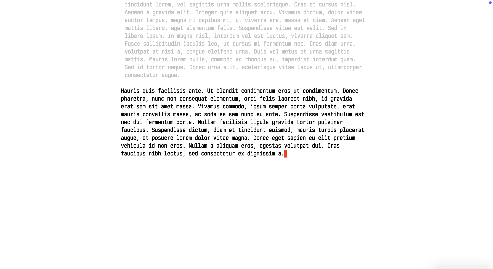

# antares.el — distraction-free writing mode for Emacs

Antares is a minor mode for focused, distraction-free writing in Emacs. It keeps the text body centered on screen, hides everything that isn't the words you're writing, and optionally scrolls the buffer like a typewriter and fades all paragraphs except the one you're in. Inspired by [Olivetti](https://github.com/rnkn/olivetti).



## Features

- **Centered body** — text is kept to a fixed column width and centered horizontally using window margins, regardless of how wide the frame is
- **No fringes** — left and right fringes are hidden while the mode is active
- **Soft word wrap** — `visual-line-mode` is enabled so long lines wrap at the window edge without inserting hard newlines
- **Top breathing room** — a configurable number of blank lines is added above the buffer content via an overlay (never written to the file)
- **Typewriter scrolling** — the current line stays vertically centered at all times; as you write and press Enter, text scrolls upward, exactly like paper feeding through a typewriter
- **Paragraph focus** — all paragraphs except the one point is in are faded to a dimmer color, keeping your eye on what you are writing (paragraphs are separated by blank lines)
- **Word and character count** — current totals are shown in the mode line; set a word or character goal and the mode line appends progress as a percentage

All changes are fully restored when the mode is turned off, including when it is turned off by a change of major mode or by `revert-buffer`.

## Installation

Copy `antares.el` to somewhere on your `load-path`, then:

```elisp
(require 'antares)
```

Or with `use-package`:

```elisp
(use-package antares
  :load-path "path/to/antares")
```

## Usage

```
M-x antares-mode          toggle in the current buffer
M-x global-antares-mode   toggle in all buffers
```

To enable automatically for a specific mode:

```elisp
(add-hook 'text-mode-hook #'antares-mode)
(add-hook 'org-mode-hook  #'antares-mode)
```

### Goals

Antares always shows `C:N W:M` (characters and words) in the mode line while the mode is active. Set a goal to see progress as a percentage alongside:

```
M-x antares-target-words RET 1500 RET   set a 1500-word goal
M-x antares-target-chars RET 5000 RET   set a 5000-character goal
M-x antares-target-words RET 0    RET   clear the goal (same with antares-target-chars)
```

Goals are buffer-local. Setting a word goal clears any active character goal and vice versa.

The counts are shown through `mode-line-misc-info`. If you use a custom mode line, make sure it displays that variable, or the counts won't appear.

## Customization

All variables belong to the `antares` customize group:

```
M-x customize-group RET antares RET
```

---

### `antares-body-width`

**Type:** integer
**Default:** `80`

The target width of the text body in columns. Antares computes the window margin as `(window-width - scroll-bar - divider - antares-body-width) / 2` and sets both the left and right margin to that value. If the window is narrower than `antares-body-width`, the margin is simply 0 and no centering is applied.

```elisp
(setq antares-body-width 72)   ; narrower, more book-like
(setq antares-body-width 100)  ; wider
```

---

### `antares-top-lines`

**Type:** integer
**Default:** `2`

Number of blank lines inserted above the buffer content as visual breathing room. These lines are added via an overlay and are never written to the file. Set to `0` to remove the top padding entirely.

```elisp
(setq antares-top-lines 0)   ; no top padding
(setq antares-top-lines 4)   ; more space at the top
```

---

### `antares-typewriter`

**Type:** boolean
**Default:** `t`

When non-nil, the current line is always kept vertically centered in the window. After every command that moves point or edits the text, Emacs scrolls the window so point sits at the middle row. As you type and lines accumulate, the earlier text scrolls upward — the same way paper moves through a typewriter.

Set to `nil` to allow normal Emacs scrolling while keeping the other antares features active.

```elisp
(setq antares-typewriter nil)   ; disable typewriter scrolling
```

---

### `antares-typewriter-skip-commands`

**Type:** list of symbols
**Default:** `'(scroll-left scroll-right recenter-top-bottom scroll-bar-toolkit-scroll scroll-bar-drag scroll-bar-scroll-up scroll-bar-scroll-down mouse-drag-region mouse-set-point mouse-set-region)`

Commands that do **not** trigger typewriter re-centering. Scroll bar and horizontal scroll commands are listed so you can freely scroll to read earlier text, mouse commands so the text doesn't jump under the mouse while you click, and `recenter-top-bottom` so `C-l` keeps cycling between top, middle and bottom.

Commands that carry the `scroll-command` symbol property — including `mwheel-scroll`, `pixel-scroll-precision`, `scroll-up-command` and `scroll-down-command` — are always skipped, so they don't need to be listed. Commands that neither move point nor change the text (saving, `C-g`, …) never re-center either, so the view stays where you scrolled it until you resume moving or editing.

Add any other scroll or navigation command that you want to exempt:

```elisp
(add-to-list 'antares-typewriter-skip-commands 'my-custom-scroll-fn)
```

---

### `antares-dim-others`

**Type:** boolean
**Default:** `t`

When non-nil, all text outside the current paragraph is faded using the `antares-dim` face. Only the paragraph point is in is shown at full brightness. The dimmed regions are updated after every command, so focus follows the cursor as you move between paragraphs.

Paragraphs are runs of non-blank lines separated by blank lines. In a buffer with no blank lines (for example, one paragraph per line separated by single newlines) the whole buffer counts as one paragraph and nothing is faded.

Set to `nil` to keep all text at the same brightness.

```elisp
(setq antares-dim-others nil)   ; disable paragraph dimming
```

---

### `antares-global-modes`

**Type:** list of symbols
**Default:** `'(text-mode)`

Major modes (or their derivatives) in which `global-antares-mode` activates. Each entry is checked with `derived-mode-p`, so subclasses like `markdown-mode` and `org-mode` (both derived from `text-mode`) are picked up automatically. The minibuffer and internal buffers whose name begins with a space are always excluded.

```elisp
(setq antares-global-modes '(text-mode))             ; only text modes (default)
(setq antares-global-modes '(text-mode prog-mode))   ; also programming buffers
(setq antares-global-modes nil)                       ; everywhere
```

---

### `antares-dim` (face)

The face applied to all paragraphs except the current one when `antares-dim-others` is non-nil. Defaults to a dark grey on dark backgrounds and a light grey on light backgrounds; on terminals with fewer than 88 colors it inherits from the `shadow` face instead.

Customize it to match your theme:

```elisp
;; Example: slightly transparent feel on a dark theme
(set-face-attribute 'antares-dim nil :foreground "#555555")

;; Example: more aggressive fade on a light theme
(set-face-attribute 'antares-dim nil :foreground "#d8d8d8")
```

Or via `M-x customize-face RET antares-dim RET`.

---

## Example configuration

```elisp
(use-package antares
  :load-path "~/elisp/antares"
  :hook ((org-mode text-mode markdown-mode) . antares-mode)
  :custom
  (antares-body-width  80)
  (antares-top-lines    2)
  (antares-typewriter   t)
  (antares-dim-others   t))
```

To change only the dim color without touching other faces:

```elisp
(with-eval-after-load 'antares
  (set-face-attribute 'antares-dim nil :foreground "#3a3a3a"))
```
